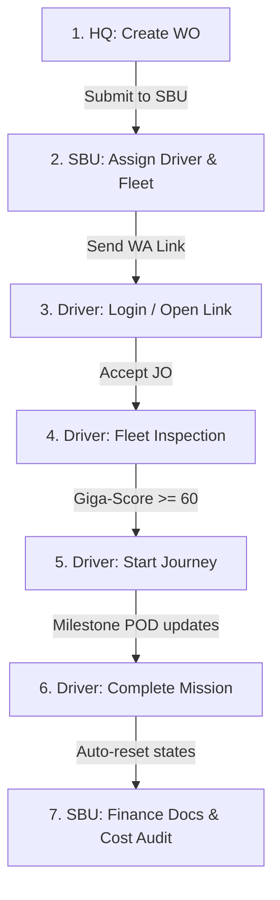

# 🚛 Dokumen Pengujian Operasional: Alur Trucking (HQ to SBU to Driver Portal)
**Tanggal Pengujian:** 26 Mei 2026  
**Status:** SIAP GOLIVE  

Dokumen ini merinci skenario pengujian fungsional terintegrasi untuk SBU Trucking dan Driver Portal SentraLogis.

---

## 1. Lingkup Pengujian (Test Scope)
Pengujian mencakup integrasi penuh dari pembuatan perintah kerja (Work Order) di HQ hingga penyelesaian tugas oleh Driver di jalan, serta rekonsiliasi keuangan di sistem.

---

## 2. Rincian Skenario Pengujian (Test Cases)

### Kasus Uji 1: Siklus Sukses Utama (Happy Path)
* **Deskripsi:** HQ membuat WO, SBU menugaskan unit, Driver menyelesaikan pengiriman langkah-demi-langkah.
* **Langkah-langkah:**
  1. **HQ Dispatcher:** Masuk `/hq/work-orders`, klik *Ororchestrate Work Order*. Buat WO Trucking untuk customer, tambahkan stops (Muat A, Bongkar B), lalu klik *Submit to SBU*.
  2. **SBU Operator:** Masuk `/sbu/trucking/work-orders`, temukan item baru di tab *Need Assignment*. Klik *Manage*, pilih Transporter/Fleet (OWN) dan Driver (Ubanan/Jojon), set Driver Share %, klik *Confirm Assignment*.
  3. **WhatsApp Link Dispatch:** Klik tombol *LINK TO DRIVERS* untuk mengirimkan tautan portal driver.
  4. **Driver (Jojon):** 
     - Buka *Driver Portal* `/driver/portal`.
     - Lakukan *Absen Masuk (Check-In)* untuk memilih plat truk.
     - Lakukan *Cek Kondisi Truk (Inspeksi)* dengan skor kelayakan >= 60 (Layak Jalan).
     - Buka *Tugas Baru*, periksa rute, lalu klik **TERIMA TUGAS INI** (driver_response: `accepted`, status: `ORDER DITERIMA`).
     - Klik **BERANGKAT MENUJU MUAT (START)** saat mulai jalan (status: `DALAM PERJALANAN`).
     - Tiba di Stop 1: Klik **TIBA DI [MUAT]** (status: `TIBA DI [MUAT]`).
     - Lakukan proses muat, ambil foto POD, lalu klik **SELESAIKAN MUAT** (status: `MENUJU [BONGKAR]`).
     - Tiba di Stop 2: Klik **TIBA DI [BONGKAR]** (status: `TIBA DI [BONGKAR]`).
     - Lakukan proses bongkar, ambil foto POD, lalu klik **SELESAIKAN BONGKAR** (status: `MENUNGGU SELESAI`).
     - Klik tombol **PEKERJAAN SELESAI** untuk menutup tugas.
  5. **Verifikasi Sistem:**
     - Status WO dan JO berubah menjadi `PEKERJAAN SELESAI`.
     - Status plat truk otomatis kembali menjadi `available`.
     - Statistik driver (`total_jobs_completed` bertambah 1, `total_km_driven` bertambah 50).
     - Entri *driver_performance_logs* dengan type `KM_LOG` berhasil dibuat.

### Kasus Uji 2: Penolakan Tugas oleh Driver (Rejection Flow)
* **Deskripsi:** Menguji penanganan apabila driver menolak tugas yang diberikan.
* **Langkah-langkah:**
  1. **SBU Operator:** Assign JO baru ke driver.
  2. **Driver:** Masuk portal, klik tugas baru, lalu klik tombol **TOLAK** dan isi catatan penolakan (misal: "Ban bocor").
  3. **Verifikasi:**
     - Kolom `driver_response` menjadi `rejected` dan `rejection_note` berisi alasan penolakan.
     - Status WO Item kembali menjadi `NEED ASSIGNMENT` agar operator SBU dapat memilih supir pengganti.

### Kasus Uji 3: Pencegahan Melompati Rute (Sequential Stop Lock)
* **Deskripsi:** Memastikan driver tidak dapat menandai stop kedua selesai sebelum stop pertama selesai.
* **Langkah-langkah:**
  1. **Driver:** Mulai perjalanan (status: `DALAM PERJALANAN`).
  2. **Driver Action:** Pada rute stop ke-2 (Bongkar), coba klik tombol "TIBA DI".
  3. **Verifikasi:**
     - Tombol "TIBA DI" untuk stop ke-2 dinonaktifkan secara visual (Premium Lock UI) dengan tulisan `LOCK: SELESAIKAN STOP SEBELUMNYA DULU`.
     - Apabila dipaksa lewat API, API akan mengembalikan status 400 Bad Request dengan pesan error: `Anda harus menyelesaikan stop sebelumnya...`.

### Kasus Uji 4: Integrasi Kasbon Keuangan (Ancillary Cost & Payout)
* **Deskripsi:** Memvalidasi pembayaran advance driver dan pencatatan sisa pelunasan.
* **Langkah-langkah:**
  1. **SBU Operator:** Di AssignmentModal, tentukan `estimated_distance` (misal 50 KM) dan Driver Share % (20%), sistem mengalkulasi Driver Payout = Rp. 500,000. Masukkan Advance Amount = Rp. 200,000.
  2. **SBU Finance:** Buka dashboard keuangan `/sbu/trucking/completed`, temukan JO tersebut. Klik *Mark Paid* untuk kasbon/advance.
  3. **Driver Portal:** Temukan notifikasi berwarna hijau di atas detail JO: `DANA OPERASIONAL CAIR - Uang jalan Rp. 200,000 telah ditransfer. Silakan memulai perjalanan Anda.`
  4. **Job Completion:** Driver menyelesaikan tugas.
  5. **Verifikasi Keuangan:**
     - Sisa Hak Driver terhitung otomatis Rp. 300,000 (Payout - Advance).
     - Total biaya operasional (`vendor_price` vs `extra_cost`) terakumulasi dengan benar di audit akhir.

---

## 3. Matriks Hasil Pengujian (Test Matrix Results)

| No | Kasus Uji | Ekspektasi | Hasil | Status |
|----|-----------|------------|-------|--------|
| 1  | Siklus Sukses Utama | JO/WO Selesai, Truk Available, Stats Driver Naik | Sesuai Ekspektasi | ✅ PASS |
| 2  | Penolakan Supir | WO kembali ke SBU, Rejection Note tercatat | Sesuai Ekspektasi | ✅ PASS |
| 3  | Stop Lock Validation | Driver tidak bisa lompati stop | Sesuai Ekspektasi (Locked UI + API Block) | ✅ PASS |
| 4  | Uang Jalan (Advance) | Notifikasi cair muncul, sisa hak driver akurat | Sesuai Ekspektasi | ✅ PASS |

---

## 4. Rekomendasi Pra-Rilis (Pre-Release Checklist)
1. **PWA Offline Mode:** Pastikan service worker termuat dengan benar agar supil dapat melihat rute jika sinyal lemah.
2. **Foto POD Compress:** Disarankan melakukan resize/compress base64 foto sebelum upload agar hemat bandwidth supil.
3. **Database Indexing:** Pastikan index `idx_job_orders_driver` dan `idx_job_routes_jo` terpasang di database agar query responsif.
