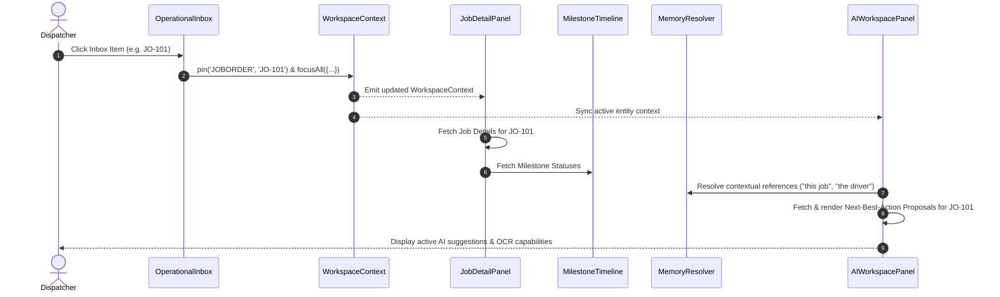

# 142. Dispatcher Workspace — Architecture & Component Hierarchy

## Executive Overview

The **Dispatcher Workspace** is the core operational interface for logistics dispatchers in Sentralogis Copilot. Designed as an intelligent, tri-pane workspace, it merges high-density operational monitoring, active mission control, and automated AI co-pilot suggestions into a unified reactive dashboard.

---

## 3-Column Layout Design

```
+------------------------+------------------------------------+----------------------------------+
| Column 1: Inbox        | Column 2: Mission Control          | Column 3: AI Co-Pilot Panel      |
| (Operational Inbox)    | (Job Details & Milestone Timeline) | (AI Suggestions & Input Copilot) |
| Width: 320px - 380px   | Width: Flexible (Flex-1)           | Width: 380px - 440px             |
+------------------------+------------------------------------+----------------------------------+
| • Category Filters     | • Active Job Header & Status Badges| • Next-Best-Action Proposals     |
| • Search & Priority    | • Milestone Timeline (DONE/ACT/PEND)| • Quick Action Confirmations     |
| • 7 Alert Categories   | • Driver, Vehicle, Cargo Cards     | • WhatsApp Paste Parser          |
| • Real-time Polling    | • Document & POD Preview           | • Image OCR Dropzone (POD/Seal)  |
+------------------------+------------------------------------+----------------------------------+
```

1. **Left Column (Operational Inbox)**: Priority-ranked alert feeds categorized by operational status (Delayed Jobs, Waiting POD, Unassigned Drivers, etc.).
2. **Center Column (Mission Detail & Timeline)**: Deep-dive view into the currently selected job order, including real-time milestone progress, asset status, and telemetry updates.
3. **Right Column (AI Co-Pilot Panel)**: Contextually aware assistance panel rendering proactive action proposals, unstructured WhatsApp message extraction, and multi-modal document OCR uploads.

---

## Component Hierarchy Tree

```
DispatcherWorkspace (Container View)
├── WorkspaceHeader
│   ├── SBUSwitcher
│   ├── ActiveContextBadge
│   └── GlobalQuickSearch
├── OperationalInbox (Left Column)
│   ├── CategoryTabSelector
│   ├── InboxFilterToolbar (Search, Priority, SBU)
│   ├── InboxItemList
│   │   └── InboxCard (Selection & Priority Status)
│   └── InboxPaginationFooter
├── JobDetailPanel (Center Column)
│   ├── JobHeaderCard (JOB-ID, Customer, Route, SLA status)
│   ├── AssetAssignmentBar (Driver, Vehicle, Container, Seal)
│   ├── MilestoneTimeline
│   │   ├── MilestoneItem (DONE / ACTIVE / PENDING)
│   │   └── TimelineTelemetryBadge (Geofence / ETA / Speed)
│   └── DocumentGalleryPreview (POD, Surat Jalan, Container Seals)
└── AIWorkspacePanel (Right Column)
    ├── AIContextSummaryCard (Pinned Entity State)
    ├── SuggestionPanel
    │   ├── ProposalCard (Intent, Entities, Confidence, Risk Level)
    │   └── ConfirmationDialogModal (Permission check & Execution)
    ├── WhatsAppParsePanel
    │   ├── RawInputArea (Paste WA conversation)
    │   └── OperationalExtractPreview (Filtered greetings, structured intents)
    └── ImageDropZone
        ├── FileDropArea (POD, Seal, Container, Surat Jalan)
        └── OCRResultCard (Extracted Container #, Seal #, Driver Signature)
```

---

## Interactive Data Flow Strategy



---

## Copilot Architecture & Engine Integration

The Dispatcher Workspace acts as the primary visual orchestrator for the underlying Sentralogis Copilot runtime:

- **`WorkspaceContext`**: Maintains immutable state for active entities (`activeJob`, `activeDriver`, `activeVehicle`, `activeCustomer`, `activeContainer`).
- **`MemoryResolver`**: Intercepts natural language queries and resolves pronouns (e.g. *"Assign driver to this job"*) into explicit IDs (`JO-101`).
- **`CopilotEngine` & `ActionPlanner`**: Evaluates active job health, SLA risks, and operational memory to generate structured `ExecutionPlan` proposals.
- **`ActionBridge`**: Executes approved actions back into core domain services (e.g. `AssignDriverCommand`, `SubmitPODCommand`).

---

## Performance Requirements

| Metric | Target Boundary | Architectural Strategy |
| :--- | :--- | :--- |
| **Inbox Filter Response** | `< 15ms` | Client-side memory filtering over pre-fetched operational feeds. |
| **Workspace Context Switch** | `< 50ms` | Immutable `WorkspaceContext.focusAll()` updates with React state batching. |
| **Milestone Timeline Render** | `< 30ms` | Virtualized list rendering for long job order event histories. |
| **WA Text Extraction** | `< 100ms` | RegEx-driven greeting suppression & client-side regex parsing. |
| **OCR Document Scan** | `< 800ms` | Async worker execution with optimistic UI loading states. |

---

## State Management & Persistence Strategy

- **React Local State**: Component-level state (`useState`) manages transient UI states (e.g. tab selections, active drag-and-drop file states, search queries).
- **Context Provider**: `CopilotContextProvider` distributes the unified `OperationalContext` across all sub-components.
- **`sessionStorage` Persistence**:
  - Key `sentralogis_workspace_context`: Preserves pinned entities and active job selections across tab refreshes.
  - Key `sentralogis_wa_drafts`: Holds uncommitted WhatsApp extraction drafts.
