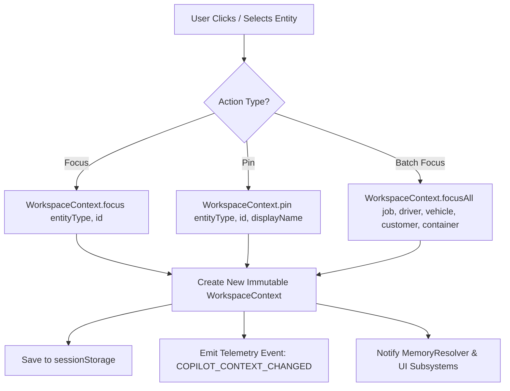

# 144. Smart Context — Auto-Update Flow & Entity Pinning

## Overview

**Smart Context** is the state management and resolution engine that allows Sentralogis Copilot to maintain situational awareness of what the dispatcher is viewing and working on. It binds UI interactions to the underlying `WorkspaceContext` and `MemoryResolver`.

---

## Recognized Entity Types

Smart Context recognizes 5 primary operational entity types:

1. **`JOBORDER`**: Unique identifier for the freight job (e.g. `JO-2024-001`).
2. **`DRIVER`**: Driver profile ID or name (e.g. `DRV-881` / Budi Santoso).
3. **`VEHICLE`**: Fleet truck / license plate (e.g. `VEH-102` / B 9812 UI).
4. **`CUSTOMER`**: Shipper / Consignee account ID (e.g. `CUST-55` / PT Mayora).
5. **`CONTAINER`**: Shipping container ID (e.g. `TGHU1234567`).

---

## Pin vs. Focus Distinction

| Concept | Scope | Behavior | Use Case |
| :--- | :--- | :--- | :--- |
| **`Focus`** | Temporary / Transient | Sets active target entity in current view without locking. Overwritten when navigating to a new item. | Hovering or viewing a job preview in the inbox. |
| **`Pin`** | Persistent / Locked | Locks the entity in `WorkspaceContext.pinnedEntities`. Preserved across inbox navigation until explicitly unpinned. | Working on a specific driver reassignment while browsing multiple inbox alerts. |

---

## `focusEntity` Flow Diagram



---

## `focusJob` Batch Operation

When a dispatcher clicks an inbox item, `focusJob` automatically sets all related entities in a single atomic state transition:

```typescript
// Helper execution on WorkspaceContext
const updatedContext = workspaceContext.focusAll({
  job: 'JO-2024-0891',
  driver: 'DRV-102',
  vehicle: 'VEH-554',
  customer: 'CUST-301',
  container: 'TGHU1234567',
  timeline: 'TL-8891'
});
```

---

## Memory Architecture Integration

Smart Context operates across three memory tiers:

```
+-------------------------------------------------------------------------+
|                              Memory Hierarchy                           |
+-------------------------------------------------------------------------+
| 1. SessionMemory     : In-memory active conversation context            |
| 2. WorkspaceMemory   : Currently focused & pinned entities in workspace |
| 3. OperationalMemory : Global system state (Delayed jobs, Waiting PODs)  |
+-------------------------------------------------------------------------+
```

---

## `MemoryResolver` Pronoun Resolution Examples

Before sending user text to the AI LLM pipeline, `MemoryResolver.resolveReferences()` parses and replaces contextual pronouns:

| Input Text | Active Context | Resolved Text Output |
| :--- | :--- | :--- |
| *"Assign driver to this job"* | Active Job: `JO-101` | *"Assign driver to JO-101"* |
| *"Send WhatsApp to the driver"* | Active Driver: `DRV-202` | *"Send WhatsApp to DRV-202"* |
| *"Check status of the delayed one"* | `OperationalMemory.getDelayedJobs()[0]` = `JO-999` | *"Check status of JO-999"* |

---

## Telemetry Events Emitted

| Event Name | Trigger Condition | Payload Schema |
| :--- | :--- | :--- |
| **`COPILOT_CONTEXT_PINNED`** | Dispatcher pins an entity card. | `{ entityType: string, id: string, timestamp: number }` |
| **`COPILOT_CONTEXT_UNPINNED`** | Dispatcher unpins an entity card. | `{ entityType: string, id: string, timestamp: number }` |
| **`COPILOT_CONTEXT_FOCUSED`** | Active focus changes via inbox selection. | `{ activeJob: string, activeDriver: string, timestamp: number }` |
