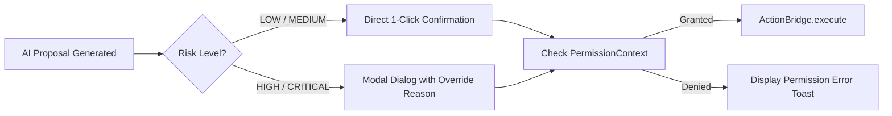

# 145. AI Workspace — Suggestion Panel, WhatsApp Parsing, Image OCR

## Overview

The **AI Workspace Panel** forms the right column of the Dispatcher Workspace. It delivers proactive Next-Best-Action proposals, parses unstructured WhatsApp driver communications, and performs image OCR document recognition for fast operational updates.

---

## 1. AI Suggestion Panel

### Proposal Fields & Structure

Every AI suggestion rendered in the workspace adheres to the `ProposalCard` model:

- **`intent`**: Target action code (e.g. `ASSIGN_DRIVER`, `UPDATE_STATUS`, `VERIFY_POD`).
- **`entities`**: Key-value map of extracted target IDs (`jobId`, `driverId`, `containerNo`).
- **`riskLevel`**: Assessment score (`LOW` | `MEDIUM` | `HIGH` | `CRITICAL`).
- **`confidence`**: Intent resolution score (`0.0` to `1.0`).
- **`requiredPermission`**: RBAC permission string (e.g. `TRUCKING:DISPATCH`).

### Confirmation Flow & Risk Assessment



---

## 2. WhatsApp Paste Panel

### Text Extraction Pipeline

Dispatchers frequently copy raw WhatsApp chat transcripts sent by drivers or field staff. The extraction pipeline automatically converts unformatted text into structured execution plans:

1. **Language Detection**: Detects Indonesian / Bahasa Gaul logistics terminology (e.g. *"muat"*, *"bongkar"*, *"supir"*, *"laka"*, *"surat jalan"*).
2. **Greeting Suppression**: Filters conversational filler, greetings (*"Halo"*, *"Selamat pagi"*, *"Pak"*), and emojis.
3. **Operational Entity Extraction**: Identifies driver names, truck plates, container numbers (`TGHU1234567`), seal numbers (`SEL-9812`), and job IDs (`JO-101`).
4. **ExecutionPlan Generation**: Formats extracted entities into executable command proposals.

### Example

```
[Raw WhatsApp Input]
Halo 😊 Selamat pagi pak.
Supir Budi Santoso (DRV-102) sudah muat di Tanjung Priok.
Nomor kontainer TGHU1234567 dan segel SEL-9988.
Mohon update status JO-5544.

[Extracted Proposal Output]
- Intent: UPDATE_JOB_PROGRESS
- Job Order: JO-5544
- Driver: Budi Santoso (DRV-102)
- Milestone: CONTAINER_LOADED
- Container #: TGHU1234567
- Seal #: SEL-9988
- Confidence: 0.96
```

---

## 3. Image Drop Zone & Document OCR

### Supported Document Types

The dropzone categorizes and processes 4 key logistics documents based on filename patterns and visual classification:

| Document Type | Recognized Identifiers | Extracted OCR Fields |
| :--- | :--- | :--- |
| **`POD`** (Proof of Delivery) | `pod_*.png`, `bukti_terima.jpg` | Recipient signature, Delivery date, Stamped Surat Jalan # |
| **`CONTAINER`** | `container_*.jpg`, `tghu*.png` | Container ISO Code (4 alpha + 7 digits), Tare weight |
| **`SEAL`** | `seal_*.jpeg`, `segel_*.jpg` | Bolt seal serial number |
| **`SURAT_JALAN`** | `surat_jalan_*.pdf`, `sj_*.png` | Origin/Destination addresses, Cargo quantity, Driver ID |

### Vision Adapter Integration & OCR Flow

- Uses `MockVisionAdapter` in development/staging and integrates with Google Gemini 1.5 Flash Vision in production.
- Extracted details are pre-filled directly into the active `JobDetailPanel` for dispatcher verification.

---

## 4. Conversation Persistence & Memory Integration

- **`sessionStorage` Strategy**: Chat exchanges and active proposals persist under `sentralogis_ai_conversation`, preserving conversational history during page reloads.
- **`MemoryResolver` Integration**: Allows dispatchers to issue contextual follow-up commands in the AI chat bar (e.g. *"Show POD for the last completed job"*).

---

## 5. Future Evolution Roadmap

- **Production WhatsApp Webhook Integration**: Direct integration with official WhatsApp Business API webhooks to bypass manual copy-pasting.
- **Live Gemini Vision API**: Native multi-modal processing for low-quality or rotated physical receipt photos taken by drivers on mobile devices.
