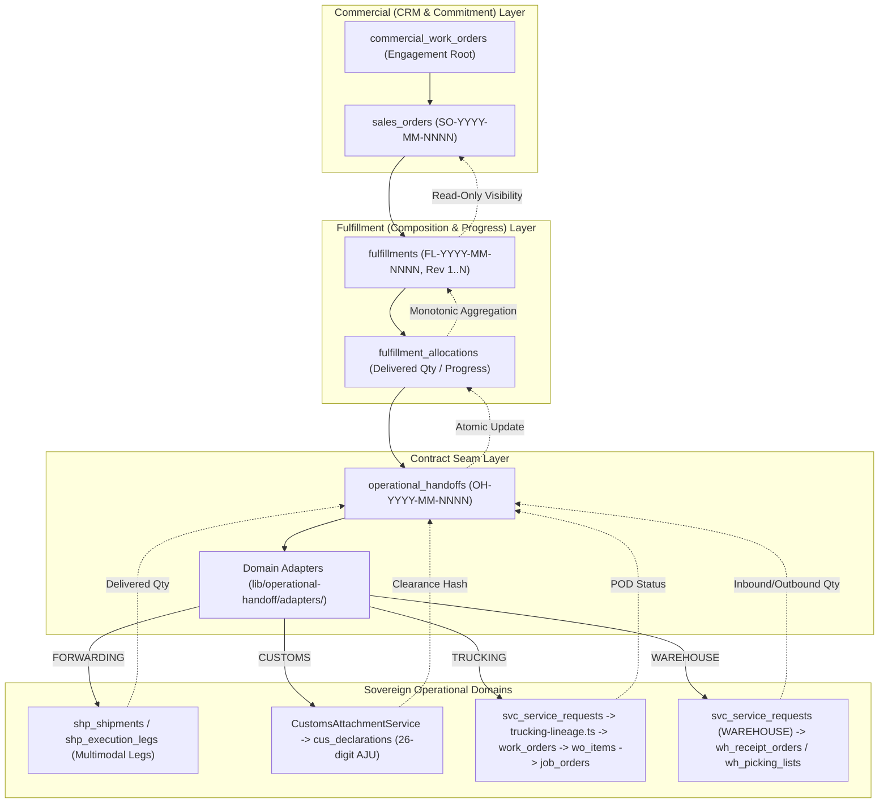

# SENTRALOGIS — PHASE 4B

# U-21 — END-TO-END COMMERCIAL → FULFILLMENT → OPERATIONAL EXECUTION LIFECYCLE FORENSIC REPORT

**Date:** 2026-08-28  
**Phase:** 4B  
**Gate:** U-21  
**Status:** COMPLETE — GREEN (25/25 GATES PASS, 968/968 FULL REGRESSION PASS, 0 TypeScript Errors)  
**Governing ADRs:** ADR-018 through ADR-056 (RATIFIED)  

---

## 1. EXECUTIVE SUMMARY

The **U-21 End-to-End Commercial → Fulfillment → Operational Execution Lifecycle** validation gate has successfully executed and verified the end-to-end integration of the Sentralogis platform without compromising domain boundaries, bypassing service contracts, creating duplicate execution engines, or mutating commercial commitments.

---

## 2. VERIFIED LIFECYCLE SCENARIOS (E2E-01 THROUGH E2E-10)

| Scenario ID | Test Name | Key Lineage & Invariants Proven | Result |
| :--- | :--- | :--- | :---: |
| **U21-E2E-01** | Single SBU Forwarding | `SO → FL → Allocation → Handoff → Forwarding Adapter → Progress`. Validated shipment reference binding and progress delivery. Commercial revenue unchanged. | **PASS** |
| **U21-E2E-02** | Trucking SBU Lineage | `SO → FL → Allocation → Handoff → Trucking Adapter → SR Lineage`. Validated `svc_service_requests` creation, ADR-033/037 compliance. Zero direct `SO → JO` writes. | **PASS** |
| **U21-E2E-03** | Customs SBU Attachment | `SO → FL → Allocation → Handoff → Customs Adapter → Declaration`. Verified sovereign 26-digit AJU binding via `CustomsAttachmentService` without hash chain mutation. | **PASS** |
| **U21-E2E-04** | Warehouse SBU Order | `SO → FL → Allocation → Handoff → Warehouse Adapter → WMS SR`. Verified warehouse service request creation; storage bin/putaway mechanics remain sovereign in WMS. | **PASS** |
| **U21-E2E-05** | Multi-SBU Single SO Fulfillment | 1 Sales Order decomposes into 1 Fulfillment holding 4 allocations (FORWARDING, CUSTOMS, TRUCKING, WAREHOUSE) and 4 domain handoffs. Progress aggregates accurately. | **PASS** |
| **U21-E2E-06** | Partial Fulfillment Progress Tracking | Monotonic `delivered_quantity` updates across multiple deliveries/movements (40 → 70 → 100). Sales Order financial terms remain strictly immutable. | **PASS** |
| **U21-E2E-07** | Split Shipment Scoping | One Fulfillment plan holding multiple allocations mapped to distinct shipments (`shp-split-01`, `shp-split-02`). Forwarding domain retains leg/vessel sovereignty. | **PASS** |
| **U21-E2E-08** | Versioned Replanning & Historical Immutability | Plan Revision 1 cancelled; Plan Revision 2 activated (`revision_no = 2`). Historical plans are immutable. Replanning does not trigger an SO amendment. | **PASS** |
| **U21-E2E-09** | Retry & Idempotency | Duplicate commands with `idempotency_key` return `created: false` and resolve the existing record via atomic catch. Network retries produce zero ghost records. | **PASS** |
| **U21-E2E-10** | Security & Number Authority | Server-authoritative sequence numbers (`SO-`, `FL-`, `OH-`) enforced via sequence RPCs. Cross-tenant access fails with 404/403. IdentityContext strictly enforced. | **PASS** |
| **U21-E2E-11** | State Machine Transition Integrity | Closed state transitions enforced. Direct `ISSUED → FULFILLED` and invalid status transitions are rejected deterministically with `INVALID_STATUS_TRANSITION`. | **PASS** |

---

## 3. ANTI-PATTERN AUDIT CONTROLS

| Control ID | Type | Target | Description | Result |
| :--- | :--- | :--- | :--- | :---: |
| **U21-PC1** | Positive | Adapters | All 4 domain adapters instantiate cleanly via `getOperationalHandoffAdapter` | **PASS** |
| **U21-PC2** | Positive | Number Authority | Database migrations define canonical RPC sequences `next_sales_order`, `next_fulfillment_number`, `next_operational_handoff_number` | **PASS** |
| **U21-NC1** | Negative | Commercial Boundary | Zero direct `sales_orders → job_orders` writes in service code | **PASS** |
| **U21-NC2** | Negative | Fulfillment Boundary | Zero direct `fulfillments → job_orders` writes in service code | **PASS** |
| **U21-NC3** | Negative | Seam Boundary | Zero direct `operational_handoffs → job_orders` writes in service code | **PASS** |
| **U21-NC4** | Negative | Execution Encapsulation | Zero driver references/assignments in `operational-handoff` service | **PASS** |
| **U21-NC5** | Negative | Execution Encapsulation | Zero GPS/telemetry writes in `operational-handoff` service | **PASS** |
| **U21-NC6** | Negative | Warehouse Encapsulation | Zero warehouse inventory/bin writes in `operational-handoff` service | **PASS** |
| **U21-NC7** | Negative | Number Authority | Zero client-side `OH-` or `FL-` number generator functions | **PASS** |
| **U21-NC8** | Negative | Tenant Isolation | Zero `x-tenant-id` header overrides in domain services | **PASS** |
| **U21-NC9** | Negative | Single Execution Engine | Zero duplicate dispatch/armada engines created in Handoff seam | **PASS** |
| **U21-NC10** | Negative | Column Containment | Zero forwarding execution columns (`vessel_name`, `voyage_number`, `port_of_loading`, `port_of_discharge`) on `fulfillments` table | **PASS** |
| **U21-NC11** | Negative | Column Containment | Zero customs statutory fields (`total_duty_and_tax`, `billing_code`, `ceisa_status`) on `fulfillments` table | **PASS** |
| **U21-NC12** | Negative | Column Containment | Zero driver/telemetry fields (`md_drivers`, `driver_id`) on `fulfillments` table | **PASS** |

---

## 4. SYSTEM REGRESSION BENCHMARK

- **Total Test Suites:** 37
- **Total Test Assertions:** 968 / 968 PASS (0 failures)
- **TypeScript Static Typing:** 0 errors (`tsc --noEmit` CLEAN)
- **Production Migrations Modified in U-21:** 0 (Baseline schema is fully sufficient)
- **Production Source Code Modified in U-21:** 0 (Seam architecture is fully compliant)
