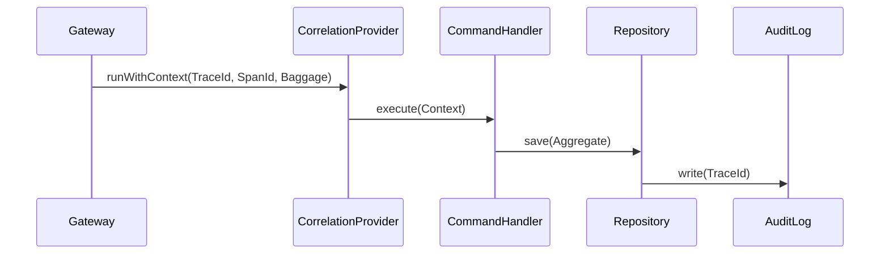
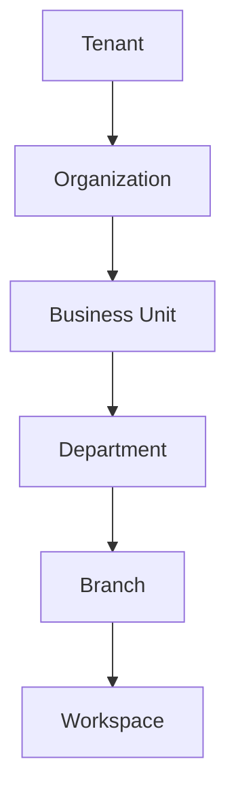

# Enterprise Domain Services Architecture (Hardened V2)

## Purpose
The **Enterprise Domain Services** layer (`src/shared/domain-services/`) provides pure-domain orchestration infrastructure that spans multiple bounded contexts. In V2 Hardening, all services strictly enforce Domain Driven Design invariants via bounded generics (`TAggregate extends AggregateRoot<any>`), preventing accidental coupling to bare objects.

## Distributed Tracing & W3C Baggage Flow
All services run within a `CorrelationProvider` context heavily mapped for **OpenTelemetry**, including standard W3C baggage propagation.


## Dependency Rules & SOLID
- **Single Responsibility**: Factories are split cleanly. `ReconstitutionFactory` now handles Snapshot loading and Event-Sourcing capabilities natively.
- **Open/Closed**: The `IDomainEventDispatcher` forces all external integrations (Dead-letter, Kafka, EventBridge, RabbitMQ) out to the Infrastructure layer, preventing Domain pollution.
- **Query Object Pattern**: To prevent interface explosion, services like `TimelineService` employ powerful Query Objects (`TimelineQuery`).

## Hierarchical Tenant Isolation
The `TenantIsolationService` natively validates complex nested enterprise boundaries.


## Event Dispatcher Pipeline Reliability
The dispatch engine now guarantees explicit asynchronous, synchronous, and transactional contracts.
```typescript
interface IDomainEventDispatcher {
  dispatchSynchronous<TEvent>(event: TEvent): Promise<void>;
  dispatchAsynchronous<TEvent>(event: TEvent): Promise<void>;
  dispatchTransactional<TEvent>(event: TEvent): Promise<void>;
  dispatchToDeadLetter<TEvent>(event: TEvent, reason: string): Promise<void>;
}
```
