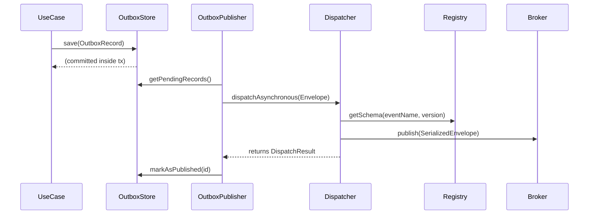

# Enterprise Event Platform Architecture

## Purpose
The SentraForge Event Platform replaces simple ad-hoc pub-sub mechanisms with a resilient, observability-first, enterprise event-driven architecture (EDA). This platform is designed to guarantee exactly-once delivery via the Outbox Pattern, enforce strict schema versioning, and abstract external brokers (Kafka, RabbitMQ, EventBridge) behind a unified CloudEvent-compatible Envelope.

## Core Abstractions

### 1. `DomainEvent` & `EventEnvelope`
Raw payload objects are no longer dispatched directly. Every event must implement the canonical `DomainEvent` contract (requiring `eventId`, `aggregateId`, `eventVersion`, etc.). The dispatcher then wraps the event in an `EventEnvelope<T>` containing:
- `metadata` (source, schemaVersion, contentType, timestamp)
- `headers` (correlation boundaries, baggage, tenant signatures)
- `payload` (the actual DomainEvent)

### 2. Outbox Pattern (Transactional Resiliency)
To prevent dual-write vulnerabilities (e.g., database commits succeeding while Kafka publishing fails), the platform natively defines the Outbox Pattern:
- `IOutboxStore`: Persists events in the same database transaction as the aggregate mutation.
- `IOutboxPublisher`: Asynchronously polls the `PENDING` records and dispatches them via the `IDomainEventDispatcher`.
- `IOutboxProcessor`: Cleans up `PUBLISHED` events and handles retries for `FAILED` events.

### 3. Dispatch Result & Observability
Dispatchers do not return `void`. They return a `DispatchResult` capturing `success`, `latencyMs`, and `retryCount`. The platform is fully prepared to instrument these results via:
- `ILogger`
- `IMetricsCollector`
- `ITraceProvider`

## Dispatch Lifecycle Diagram

## Retry Policies & DLQ
The `CompositeDomainEventDispatcher` is upgraded from a naïve `Promise.all` into a robust pipeline that interacts with `IRetryPolicy` (Exponential Backoff, Circuit Breaker). If maximum retries are exhausted, the event is automatically routed to `dispatchToDeadLetter()`.

## Future Migration Strategy (Kafka / EventBridge)
Because the `EventEnvelope` is deeply compatible with the CNCF CloudEvents standard, migrating from internal memory dispatching to AWS EventBridge or Kafka only requires mapping the `Envelope` to the specific broker's wire format in the infrastructure layer. The Domain Layer remains 100% agnostic.
