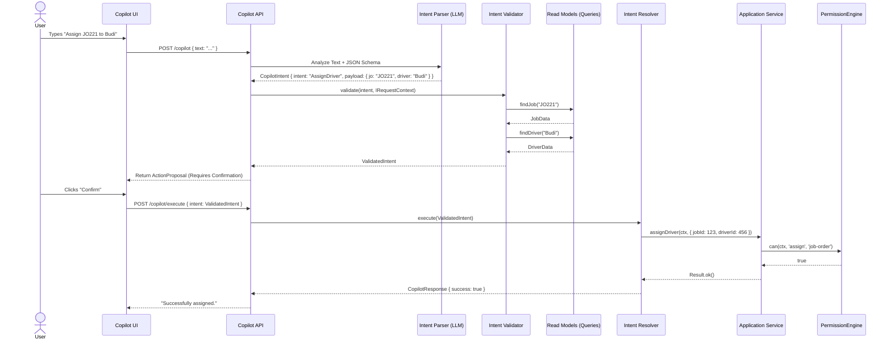

# Sentralogis Copilot Sequence Diagrams

## 1. Intent Orchestration Pipeline

```mermaid
sequenceDiagram
    actor User
    participant UI as Copilot UI
    participant API as Copilot API
    participant LLM as Intent Parser (LLM)
    participant Validator as Intent Validator
    participant Query as Read Models (Queries)
    participant Resolver as Intent Resolver
    participant AppService as Application Service
    participant Engine as PermissionEngine

    User->>UI: Types "Assign JO221 to Budi"
    UI->>API: POST /copilot { text: "..." }
    API->>LLM: Analyze Text + JSON Schema
    LLM-->>API: CopilotIntent { intent: "AssignDriver", payload: { jo: "JO221", driver: "Budi" } }
    
    API->>Validator: validate(intent, IRequestContext)
    Validator->>Query: findJob("JO221")
    Query-->>Validator: JobData
    Validator->>Query: findDriver("Budi")
    Query-->>Validator: DriverData
    Validator-->>API: ValidatedIntent
    
    API-->>UI: Return ActionProposal (Requires Confirmation)
    
    User->>UI: Clicks "Confirm"
    UI->>API: POST /copilot/execute { intent: ValidatedIntent }
    
    API->>Resolver: execute(ValidatedIntent)
    Resolver->>AppService: assignDriver(ctx, { jobId: 123, driverId: 456 })
    
    AppService->>Engine: can(ctx, 'assign', 'job-order')
    Engine-->>AppService: true
    AppService-->>Resolver: Result.ok()
    
    Resolver-->>API: CopilotResponse { success: true }
    API-->>UI: "Successfully assigned."
```
