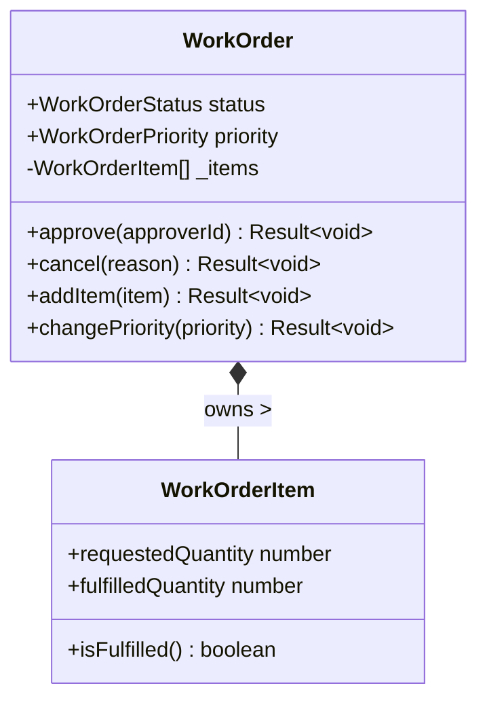
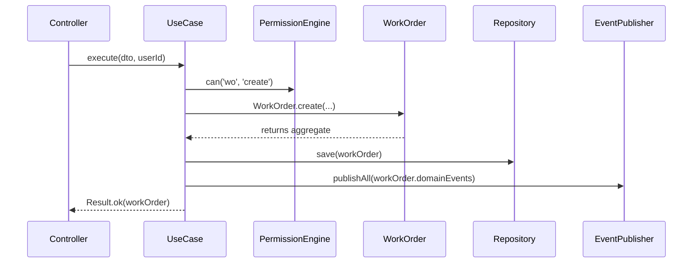

# Work Order Domain Architecture

## Overview
The Work Order module has been successfully extracted into the Phase 2A.1 Enterprise Domain Kernel architecture. It is strictly built using Domain-Driven Design (DDD), enforcing encapsulation, single responsibility, and event-driven architecture.

## Aggregate Root: \`WorkOrder\`
\`WorkOrder\` is the transactional boundary.

### Entities & Value Objects
- **WorkOrder** (Aggregate Root): Manages lifecycle (status, priority, approval, cancellation) and holds line items.
- **WorkOrderItem** (Entity): Belongs strictly to the \`WorkOrder\`. Tracks requested vs fulfilled quantities.
- **WorkOrderNumber** (Value Object): Enforces formatting and validation of the WO identifier.

### Domain Events
The \`WorkOrder\` aggregate does not perform database side-effects. Instead, it emits strongly typed Domain Events that are consumed by the Application Layer:
- \`WorkOrderCreated\`
- \`WorkOrderUpdated\`
- \`WorkOrderApproved\`
- \`WorkOrderCancelled\`

## Application Layer (Use Cases)
The application layer isolates the Domain from HTTP transport and Framework logic.
1. \`CreateWorkOrderUseCase\`
2. \`UpdateWorkOrderUseCase\`
3. \`ApproveWorkOrderUseCase\`
4. \`CancelWorkOrderUseCase\`
5. \`SearchWorkOrdersUseCase\`

### Standard Use Case Flow

## Infrastructure Layer
- \`SupabaseWorkOrderRepository\`: Implements \`IWorkOrderRepository\`. Maps directly between \`Database['public']['Tables']['wo_work_orders']\` and the Domain Entities. Zero business logic exists in this layer.

## Extension Points
- **Auditing**: Audit logging can be injected into Use Cases via the Phase 1B Security Engine.
- **Event Streaming**: The \`EventPublisher\` can be easily swapped from an in-memory bus to an Apache Kafka producer without changing a single line of Domain code.
