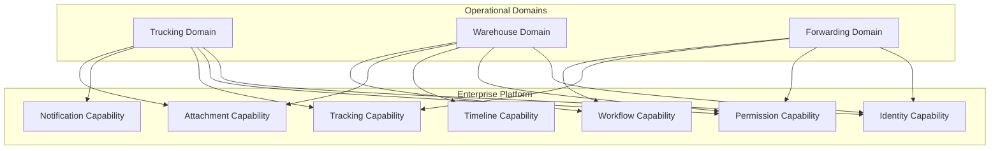

# Enterprise Capability Visualization & Dependency Blueprint

## 1. Visualization Principles
Capabilities represent stable business abilities that define what the system does. Relationships and interactions between capabilities are more important than folder structures. Architectural planning shall focus on capability interaction rather than implementation details. This blueprint visualizes the dependencies, ownership, and maturity of the Enterprise Logistics Platform capabilities using strict, evidence-based language.

## 2. Enterprise Capability Dependency Matrix
The following matrix illustrates which shared enterprise capabilities are consumed by each operational domain.

| Domain | Identity | Permission | Timeline | Tracking | Attachment | Notification | Workflow | Reporting | AI Platform |
| :--- | :---: | :---: | :---: | :---: | :---: | :---: | :---: | :---: | :---: |
| **Trucking** | ✅ | ✅ | 🟡 | 🟡 | 🟡 | 🟡 | ⚪ | ✅ | ⚪ |
| **Warehouse** | ✅ | ✅ | ⚪ | ❌ | ⚪ | ⚪ | ⚪ | ⚪ | ⚪ |
| **Depot** | ✅ | ✅ | ⚪ | ❌ | ⚪ | ⚪ | ⚪ | ⚪ | ⚪ |
| **Forwarding** | ✅ | ✅ | ⚪ | ⚪ | ⚪ | ⚪ | ⚪ | ⚪ | ⚪ |
| **Customs** | ✅ | ✅ | ⚪ | ❌ | ⚪ | ⚪ | ⚪ | ⚪ | ⚪ |
| **Cold Chain** | ✅ | ✅ | ⚪ | ⚪ | ⚪ | ⚪ | ⚪ | ⚪ | ⚪ |
| **Distribution** | ✅ | ✅ | ⚪ | ⚪ | ⚪ | ⚪ | ⚪ | ⚪ | ⚪ |

**Legend:**
- ✅ Operational (or Validated within current scope)
- 🟡 Planned (Architecture designed or slated for imminent phases)
- ⚪ Future (Anticipated, NOT VERIFIED)
- ❌ Not Applicable

*Explanatory Notes:* Tracking is highly applicable to Trucking, Forwarding, and Cold Chain, but Not Applicable to internal facility operations like Warehouse, Depot, and Customs.

## 3. Capability Ownership Matrix
Explicit ownership guarantees that business logic does not leak across organizational boundaries.

| Capability | Business Owner | Technology Owner | Primary Consumers | Current Phase | Architecture Reference | Evidence |
| :--- | :--- | :--- | :--- | :--- | :--- | :--- |
| **Identity & Permission** | IT Security | Platform Engineering | All Domains | Phase 1A | Architecture Constitution | `PermissionEngine` implemented |
| **JobOrder** | Trucking Ops | SentraForge Engineering | Trucking UI | Phase 3B | ADR-008 | `JobOrder` Aggregate implemented |
| **Driver** | Trucking Ops | SentraForge Engineering | Trucking JobOrder | Phase 3A | ADR-008 | `Driver` Aggregate implemented |
| **Vehicle** | Fleet Management | SentraForge Engineering | Trucking JobOrder | Phase 3A | ADR-008 | `Vehicle` Aggregate implemented |
| **Tracking** | Operations Control | Platform Engineering | Trucking | Phase 3D | Capability Map | Architecture Recommendation |
| **Attachment** | Operations Control | Platform Engineering | Trucking, Warehouse | Phase 3E | Capability Map | Architecture Recommendation |

## 4. Capability Interaction Diagram
The following diagram illustrates the unidirectional dependency flow from Operational Domains to Shared Platforms, and from Shared Platforms to the core Enterprise Platform.

*Note: The diagram emphasizes capability reuse. Domains remain autonomous and do not depend on each other directly.*

## 5. Capability Heatmap
Every capability is classified based on its current implementation maturity.

| Capability | Status | Evidence |
| :--- | :--- | :--- |
| **Identity / Permission** | Validated | Core security services and `PermissionEngine` are functional |
| **Trucking JobOrder** | Production Validation Pending | Complete domain aggregate with API orchestration |
| **Reporting** | Scaffolded | Legacy dashboards integrated into UI |
| **Tracking** | Planned | Architectural Blueprint approved |
| **Timeline** | Planned | Architectural Blueprint approved |
| **Attachment** | Planned | Architectural Blueprint approved |
| **Workflow** | Future | Recommended for multi-domain routing |
| **Warehouse** | Concept | NOT VERIFIED |

## 6. Capability Evolution Roadmap
Reusable capabilities are expected to emerge chronologically as the business scale demands.

`Current Scope` 
↓ 
`Trucking Domain (Validated)` 
↓ 
`Tracking Platform (Phase 3D)` 
↓ 
`Timeline Platform (Phase 3D)` 
↓ 
`Attachment Platform (Phase 3E)` 
↓ 
`Warehouse Domain (Phase 4)` 
↓ 
`Workflow Platform (Phase 4)` 
↓ 
`Forwarding Domain (Phase 5)` 
↓ 
`Depot Domain (Phase 5)` 
↓ 
`Enterprise Logistics Platform`

*Note: Reusable platforms emerge only after repeated business validation. They are extracted from successful domains rather than preceding them.*

## 7. Impact Analysis Matrix
The table below illustrates the blast radius if a shared capability undergoes breaking changes.

| If this Shared Capability changes... | These Operational Domains are affected... | Impact Level |
| :--- | :--- | :--- |
| **Identity & Permission** | Trucking, Warehouse, Depot, Forwarding, Customs | **CRITICAL** |
| **Timeline** | Trucking, Warehouse | High |
| **Tracking** | Trucking, Forwarding, Cold Chain, Distribution | High |
| **Attachment** | Trucking, Warehouse, Forwarding | Medium |
| **Notification** | Trucking, Warehouse, Forwarding | Medium |
| **Workflow** | Trucking, Warehouse, Depot, Forwarding | High |

*High-impact capabilities (e.g., Identity) require extreme scrutiny and multi-domain consensus before architectural migration.*

## 8. Domain Capability Boundaries
Operational domains possess exclusive ownership of highly specific business capabilities. These remain autonomous and should not be generalized into enterprise platforms.

- **Trucking owns:** Driver, Vehicle, Trucking JobOrder.
- **Warehouse owns:** Inventory, Putaway, Picking.
- **Depot owns:** Container Lifecycle, Stacking, Gate Operations.
- **Forwarding owns:** Shipment, Booking, Manifest.
- **Customs owns:** Declaration, HS Classification, Compliance.

## 9. Architecture Evolution Triggers
Capabilities are only promoted into shared enterprise platforms when objective conditions are met:
- A second operational domain begins migration and requires the exact same capability.
- Repeated implementation and operational duplication are objectively measured.
- Maintenance burden of isolated implementations is validated.
- Business stakeholders explicitly approve cross-SBU standardization.

Speculative engineering and premature abstraction are strictly prohibited.

## 10. Governance Rules
Every future Domain, ADR, Migration, Platform, Architecture Review, and Repository Validation must explicitly identify:
- Which operational capability it belongs to.
- Which shared capabilities it consumes.
- Whether an existing capability can be reused.
- Whether it introduces a genuinely new capability.
- Whether it changes ownership of an existing capability.

## 11. Repository Traceability
Mapping capabilities directly to current repository paths utilizing only validated implementation evidence.

| Capability | Repository Location | ADR | Implementation Status | Evidence |
| :--- | :--- | :--- | :--- | :--- |
| **Identity & Permission** | `src/domains/security` | Constitution | Validated | `PermissionEngine` unit tests |
| **Trucking JobOrder** | `src/domains/trucking/job-order` | ADR-008 | Production Validation Pending | `JobOrder.ts` explicit aggregate |
| **Trucking Driver** | `src/domains/trucking/driver` | ADR-008 | Production Validation Pending | `Driver.ts` explicit aggregate |
| **Trucking Vehicle** | `src/domains/trucking/vehicle` | ADR-008 | Production Validation Pending | `Vehicle.ts` explicit aggregate |

## 12. Executive Summary
The SentraForge Enterprise Logistics Platform possesses validated capabilities within the **Trucking**, **Identity**, and **Permission** contexts. The current operational implementations are classified as Production Validation Pending and serve as the baseline. There are currently no architectural blockers within the validated scope.

Future recommendations outline a clear migration path toward dedicated **Tracking**, **Timeline**, and **Attachment** platforms (Phases 3D & 3E). These platforms will be extracted from existing domains only when objective evolution triggers are met, ensuring architectural scalability driven entirely by objective business evidence.
