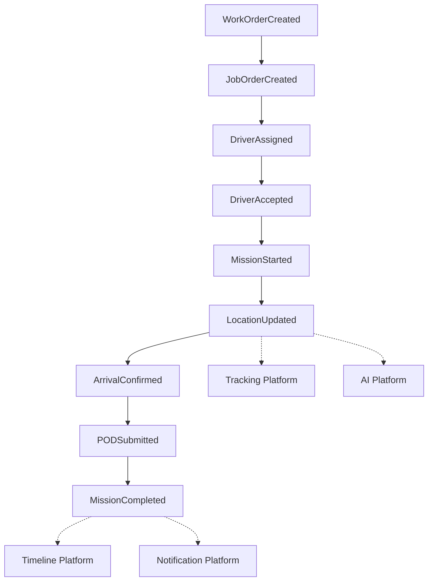

# Enterprise Event Catalog v1.0

## 1. Event Principles
- **Business Events describe business facts**: They represent meaningful occurrences within the business domain.
- **Events are immutable**: Once an event has occurred, its record can never be changed. Past events are never modified.
- **Events describe something that happened**: They are written in the past tense (e.g., `JobOrderCreated`).
- **Commands request action, Events report completed facts**: A command can fail; an event has already happened.
- **Domains own events**: The bounded context where the business state changed is the sole owner and publisher of the event.
- **Shared Platforms consume events**: Reusable infrastructure components (like Notification or Timeline platforms) listen to domain events but do not originate business events.
- **Events never own business rules**: An event is a payload of data. It contains no validation or branching logic.
- **Business terminology must always be used**: The language of the event must match the Ubiquitous Language of the specific domain.

## 2. Event Classification
The SentraForge platform categorizes events to clarify their intent and scope:

- **Business Event**: A high-level occurrence meaningful to non-technical stakeholders (e.g., `ShipmentBooked`). Owned by operational domains.
- **Domain Event**: An occurrence that mutates the state of a specific Aggregate within a Bounded Context (e.g., `DriverAccepted`). Owned by domain aggregates.
- **Integration Event**: An event specifically intended to be published across bounded contexts or systems (often a flattened or enriched Domain Event). Owned by Application/Infrastructure layers.
- **System Event**: Infrastructure-level occurrences (e.g., `DatabaseBackupCompleted`). Owned by Platform Engineering.
- **Audit Event**: Records generated specifically for compliance tracking. Owned by the Timeline Platform.
- **Notification Event**: A transient event indicating that a user needs to be informed. Owned by the Notification Platform.
- **Tracking Event**: High-frequency telemetry or geospatial data (e.g., `LocationUpdated`). Owned by the Tracking Platform.
- **AI Observation Event**: Processed inferences generated by machine learning models based on raw data streams. Owned by the AI Platform.

## 3. Enterprise Event Landscape
The current map of business events categorized by their originating domains:

**Current Validated Domain**
- **Trucking**: Production Validation Pending

**Planned Domains**
- **Warehouse**: Concept
- **Depot Container**: Concept
- **Forwarding**: Concept
- **Cold Chain**: Concept
- **Billing**: Concept
- **Analytics**: Concept
- **AI**: Concept

## 4. Trucking Event Catalog
The following represents the validated events generated within the current Trucking JobOrder scope.

| Event Name | Business Meaning | Aggregate | Produced By | Consumed By | Repository Evidence | Status |
| :--- | :--- | :--- | :--- | :--- | :--- | :--- |
| `JobOrderCreated` | A new trucking job order was successfully initialized. | `JobOrder` | `JobOrderService` | UI Dashboard | `JobOrder.ts` | Production Validation Pending |
| `DriverAssigned` | A driver has been allocated to a specific job. | `JobOrder` | `JobOrderService` | Driver App | `JobOrder.ts` | Production Validation Pending |
| `VehicleAssigned` | A specific truck has been bound to the job. | `JobOrder` | `JobOrderService` | Driver App | `JobOrder.ts` | Production Validation Pending |
| `DriverAccepted` | The driver acknowledged and accepted the assignment. | `JobOrder` | Driver App API | UI Dashboard | `JobOrder.ts` | Production Validation Pending |
| `MissionStarted` | The driver commenced physical execution of the job. | `JobOrder` | Driver App API | UI Dashboard | `JobOrder.ts` | Production Validation Pending |
| `ArrivalConfirmed` | The vehicle arrived at the designated destination. | `JobOrder` | Driver App API | UI Dashboard | `JobOrder.ts` | Production Validation Pending |
| `PODSubmitted` | Proof of Delivery was logged for the job. | `JobOrder` | Driver App API | UI Dashboard | `JobOrder.ts` | Production Validation Pending |
| `MissionCompleted` | The entire execution lifecycle of the job concluded. | `JobOrder` | `JobOrderService` | UI Dashboard, Billing (Future) | `JobOrder.ts` | Production Validation Pending |
| `MissionCancelled` | The job was permanently aborted. | `JobOrder` | `JobOrderService` | UI Dashboard | `JobOrder.ts` | Production Validation Pending |
| `LocationUpdated` | High-frequency GPS ping recorded. | None | Driver App PWA | Tracking Platform (Future) | Geolocation API | Production Validation Pending |

*Future Consumers for Trucking Events include the Timeline, Tracking, and Notification Platforms.*

## 5. Planned Event Catalog
*The following events are classified as NOT VERIFIED Concepts or Future Recommendations.*

**Warehouse (Concept)**
- `ReceivingStarted`
- `ReceivingCompleted`
- `PutawayCompleted`
- `PickingStarted`
- `PickingCompleted`
- `LoadingStarted`
- `LoadingCompleted`

**Depot (Concept)**
- `ContainerReceived`
- `ContainerReleased`
- `ContainerInspected`
- `ContainerRepaired`
- `ContainerCleaned`

**Forwarding (Concept)**
- `ShipmentBooked`
- `BookingConfirmed`
- `DocumentCompleted`
- `CargoDeparted`
- `CargoArrived`

**Customs (Concept)**
- `DeclarationSubmitted`
- `DeclarationApproved`
- `InspectionCompleted`
- `ReleaseGranted`

## 6. Event Flow Diagrams
The business flow of a typical Trucking Job Order lifecycle:

*Note: Shared platforms act exclusively as subscribers without disrupting the core business flow.*

## 7. Event Ownership Matrix
| Event | Owner Domain | Aggregate | Producer | Consumers | Status | Evidence |
| :--- | :--- | :--- | :--- | :--- | :--- | :--- |
| `MissionStarted` | Trucking | `JobOrder` | `JobOrderService` | UI / Ops | Production Validation Pending | `JobOrder.ts` |
| `PODSubmitted` | Trucking | `JobOrder` | `JobOrderService` | UI / Ops | Production Validation Pending | `JobOrder.ts` |
| `LocationUpdated` | Trucking | N/A | Driver App | Ops | Production Validation Pending | PWA API |
| `PutawayCompleted` | Warehouse | `Inventory` | `WarehouseService` | Inventory Ops | Concept | NOT VERIFIED |

## 8. Shared Platform Subscription Matrix
| Platform | Trucking Events | Warehouse Events | Depot Events | Forwarding Events | Cold Chain |
| :--- | :---: | :---: | :---: | :---: | :---: |
| **Timeline** | Planned | Concept | Concept | Concept | Concept |
| **Tracking** | Planned | NOT VERIFIED | NOT VERIFIED | Planned | Planned |
| **Attachment** | Planned | Concept | Concept | Concept | Concept |
| **Notification** | Planned | Concept | Concept | Concept | Concept |
| **Workflow** | Planned | Concept | Concept | Concept | Concept |
| **Reporting** | Validated | Concept | Concept | Concept | Concept |
| **AI** | Concept | Concept | Concept | Concept | Concept |
| **Identity** | Validated | Planned | Planned | Planned | Planned |
| **Permission**| Validated | Planned | Planned | Planned | Planned |

## 9. Repository Traceability
*Validated events mapped strictly to repository evidence.*

| Event / Transition | Aggregate | Repository | Application | UI | ADR | Evidence |
| :--- | :--- | :--- | :--- | :--- | :--- | :--- |
| Job Assignment | `JobOrder` | `SupabaseJobOrderRepository` | `JobOrderService.ts` | `work-orders/page.tsx` | ADR-008 | Source code verified |
| Driver Acceptance | `JobOrder` | `SupabaseJobOrderRepository` | `JobOrderService.ts` | `api/jo/[token]/route.ts` | ADR-008 | Source code verified |
| Mission Start | `JobOrder` | `SupabaseJobOrderRepository` | `JobOrderService.ts` | `api/jo/[token]/route.ts` | ADR-008 | Source code verified |
| POD Submission | `JobOrder` | `SupabaseJobOrderRepository` | `JobOrderService.ts` | `api/jo/[token]/route.ts` | ADR-008 | Source code verified |

## 10. Event Evolution Rules
All future architectural integrations must adhere to the following constraints:
- **Events are immutable**: Once published, they can never be modified.
- **Events describe completed facts**: They represent things that happened.
- **Commands never become events**: Intent to do something is not an event.
- **Events never mutate aggregates directly**: Handlers must issue distinct commands to other aggregates.
- **Events never perform business logic**: They act only as data carriers.
- **Events are domain owned**: Only the domain that altered the state can publish the corresponding event.
- **Shared Platforms remain subscribers**: They observe events but do not originate business events.
- **Business terminology always prevails**: Event names must use the domain's Ubiquitous Language.

## 11. Event Maturity Assessment
| Event Category | Classification | Reason |
| :--- | :--- | :--- |
| **Trucking Workflow Events** | Production Validation Pending | State transitions are explicitly coded and validated in `JobOrder.ts`, awaiting production volume verification. |
| **Trucking Tracking Events** | Production Validation Pending | GPS location payloads are structurally implemented in the PWA. |
| **Warehouse/Depot Events** | Concept | Business operations exist theoretically but lack verified architectural implementation. |
| **Timeline/Notification Events**| Planned | Structural extraction has been identified as a Future Recommendation based on current scope constraints. |

## 12. Architecture Evolution Triggers
Capabilities and events shall be extracted into dedicated platforms only when objective triggers occur:
- **Workflow Platform** extraction begins when multiple domains require configurable workflows, duplicated transition logic is validated, or runtime workflow definitions become necessary.
- **Timeline Platform** extraction begins when replay becomes business critical or audit reconstruction becomes required.
- **Tracking Platform** extraction begins when telemetry becomes standardized or multiple operational domains require tracking.
- **Attachment Platform** extraction begins when POD metadata becomes mandatory or document lifecycles become standardized.
- **Notification Platform** extraction begins when multiple domains require reusable notification orchestration.
- **AI Platform** extraction begins when multiple domains produce reusable operational observations.

*No platform shall be extracted without objective evidence.*

## 13. Executive Summary
The Enterprise Event Catalog defines the flow of business facts across the SentraForge Logistics Platform. 

Currently, the **Trucking** domain holds the only structurally verified operational events (classified as Production Validation Pending), originating primarily from the `JobOrder` aggregate. 

Planned events spanning **Warehouse**, **Depot Container**, and **Forwarding** remain classified as NOT VERIFIED Concepts. 

There are no architectural blockers within the validated scope. Future extractions of the **Tracking**, **Timeline**, and **Notification** platforms are formally documented as Future Recommendations, to be triggered strictly by objective evidence of cross-domain adoption rather than speculative engineering.
