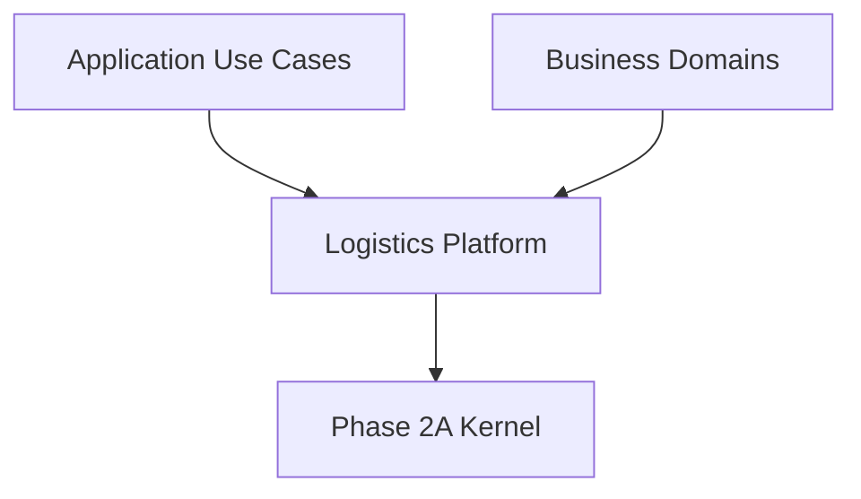

# Enterprise Logistics Platform Architecture

## Dependency Graph

## Migration Roadmap
- `pod_documents` → `Attachment Platform`
- `job_tracking` → `Tracking Platform`
- `wh_inventory_movements` → `Timeline Platform`
- `AssignmentModal.tsx` → `Assignment Platform`

## Debt Reduction
This platform eliminates over a dozen fragmented implementations of statuses, histories, and attachments scattered across React components and SQL triggers.