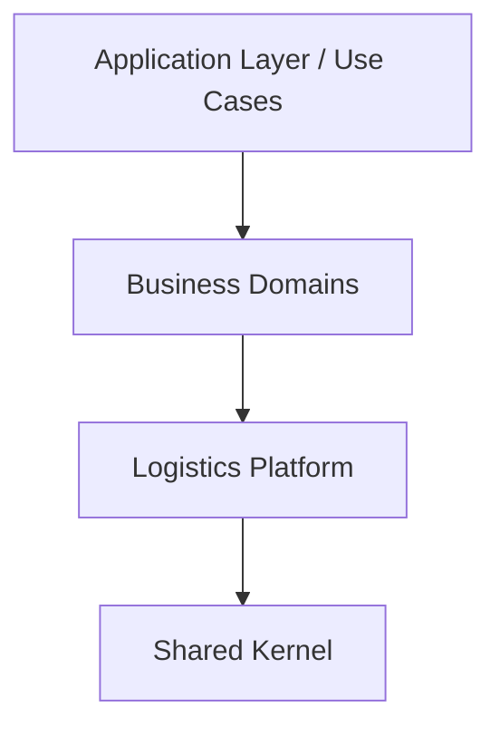

# Dependency Rules

## Architecture Flow

## Rules
1. **Platform Layer** must NEVER import from Next.js, React, or Supabase.
2. **Platform Layer** must NEVER import from Business Domains (e.g. Trucking, Warehouse).
3. **Business Domains** rely on the Platform for horizontal capabilities (State, Attachments).

## Explicitly Forbidden Dependencies
- `src/platform/logistics/*` CANNOT import `next/*`
- `src/platform/logistics/*` CANNOT import `react`
- `src/platform/logistics/*` CANNOT import `@supabase/supabase-js`
- `src/platform/logistics/*` CANNOT import `src/app/*`
- `src/platform/logistics/*` CANNOT import `src/lib/domain/*`