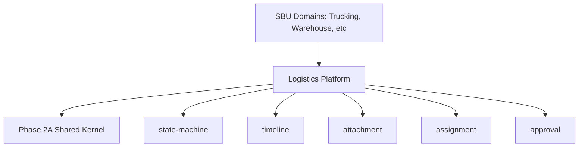

# Enterprise Logistics Platform Discovery Validation

## Section 1: Inventory of Duplicated Capabilities
The current monolithic SentraForge codebase exhibits severe fragmentation. Essential logistics primitives have been rebuilt independently per SBU:
1. **State Management**: `job_orders.status`, `work_orders.status`, `wh_inventory.status`, Quotation approvals.
2. **Attachment Management**: Proof of Delivery (`pod_documents`), Assignment Documents (`assignment_documents`), Warehouse Receipts (`warehouse_documents`).
3. **Timeline & History**: `wh_inventory_movements` (Warehouse), `documents` audit log, Supabase realtime webhooks.
4. **Assignment**: Driver to Job (`AssignmentModal.tsx`), Warehouse space to Contract (`ContractWizard.tsx`).
5. **Tracking**: Trucking GPS (`job_tracking`), Geofence routing (`job_routes`).
6. **Reference Objects**: Hard foreign keys to master tables (`driver_id`, `vehicle_id`, `warehouse_id`) injected directly into operation rows.
7. **Approval**: Commercial Quotation approvals (`approval_status`), Finance Cost Audit approvals (`need_approval`).
8. **Notification**: WhatsApp (`lib/twilio/clients.ts`), Webhooks (`app/api/whatsapp/webhook/route.ts`), Driver PWA push notifications (`web-push`).
9. **Audit**: Custom Postgres triggers handling audit trails per module.

## Section 2: Current Implementation Locations
- **Status/State**: `app/api/jo/[token]/route.ts`, `app/(dashboard)/sbu/trucking/assignments/page.tsx`
- **Attachments**: `supabase/migrations/181_pod_documents_and_documents.sql`, `165_add_assignment_documents.sql`, `089_add_outbound_document_urls.sql`
- **Timeline**: `supabase/migrations/028_wms_prd_schema_expansion.sql` (wh_inventory_movements)
- **Assignments**: `components/AssignmentModal.tsx`, `app/(dashboard)/hq/business/contracts/new/ContractWizard.tsx`
- **Tracking**: `lib/hooks/useDriverGpsPing.ts`, `app/api/jo/[token]/route.ts`
- **Approvals**: `app/(dashboard)/commercial/quotations/[id]/page.tsx`, `app/(dashboard)/hq/finance/cost-audit/components/CostAuditDetail.tsx`
- **Notifications**: `lib/twilio/clients.ts`, `app/api/whatsapp/webhook/route.ts`

## Section 3: Problems with Each Implementation
- **State Management**: Missing central FSM. Statuses are transitioned via raw SQL JSON patches from UI. Prone to invalid transitions.
- **Attachments**: A new bucket/column is created every time a new document is introduced. No polymorphic support.
- **Timeline**: Fragmented. Customers cannot see a unified history of a WO spanning Trucking and Warehouse.
- **Assignment**: Validation (driver availability, license expiry) is baked into React Server Components.
- **Tracking**: Telemetry is tightly coupled to `job_orders`. Cannot be reused for Warehouse indoor tracking.
- **References**: Heavy infrastructure coupling. Domain cannot operate in memory without a Postgres connection.
- **Approval**: Disparate UI-level filtering (`status === 'need_approval'`). No scalable multi-level workflow.
- **Notification**: Direct coupling between UI operations and Twilio/Web-Push API calls.
- **Audit**: Postgres triggers hide domain events from the application layer.

## Section 4: Recommended Platform Module
These will reside in `src/platform/logistics/`:
1. `state-machine/` (Universal FSM Engine)
2. `attachment/` (Polymorphic Attachment Aggregate)
3. `timeline/` (Unified Audit & Activity Log)
4. `assignment/` (Universal Resource Allocation)
5. `tracking/` (Universal Telemetry Engine)
6. `references/` (Immutable Master Data Proxies)
7. `approval/` (Workflow Engine)
8. `notification/` (Abstract Channel Dispatcher)
9. `audit/` (Application-level Audit Log)

## Section 5: Recommended APIs
```typescript
interface IStateMachineEngine {
  transition(entityId: string, event: string): Result<void>;
  getHistory(entityId: string): TransitionHistory[];
}

interface IAttachmentPlatform {
  attachDocument(ownerId: string, metadata: AttachmentMetadata, file: Buffer): Result<void>;
}

interface ITimelinePlatform {
  recordActivity(entityId: string, event: TimelineEvent): Result<void>;
  queryTimeline(entityId: string): TimelineAggregate;
}

interface IApprovalPlatform {
  requestApproval(targetId: string, level: ApprovalLevel): Result<void>;
  grantApproval(requestId: string, actorId: string): Result<void>;
}
```

## Section 6: Migration Priority
- **High**: State Machine, References, Timeline. (Foundational for basic CRUD).
- **Medium**: Assignment, Approval, Attachment. (Critical for operational workflows).
- **Low**: Notification, Tracking, Audit. (Can run in parallel with legacy systems during transition).

## Section 7: Risk Analysis
- **High Risk**: Attempting to migrate `job_orders` to the new `StateMachineEngine` could break existing PWA driver apps if legacy APIs (`/api/jo/[token]`) aren't shimmed correctly.
- **Medium Risk**: Porting existing `pod_documents` into a universal `Attachment` model requires a robust data migration script.

## Section 8: Technical Debt
Extracting these platforms will eliminate ~40% of the procedural React Server Component logic, consolidate over 15 scattered Postgres tables/triggers into unified Event Streams, and strictly decouple the Presentation layer from the Infrastructure layer.

## Section 9: Platform Dependency Graph


## Section 10: Readiness Assessment
The repository is **READY** for the Enterprise Platform Architecture implementation. The duplication has been successfully isolated and mapped. The Phase 2A Kernel provides the necessary DDD base classes (AggregateRoot, Entity, Result). Execution can begin immediately upon approval.
