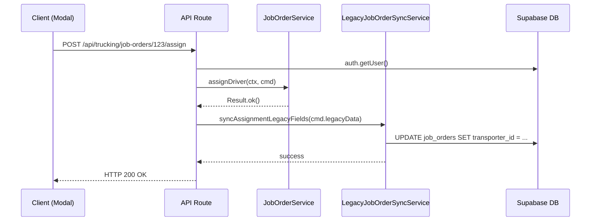

# Phase 3B.1.6: Legacy Adapter Refactoring

## 1. Overview
This document outlines the resolution of the architectural violation discovered during Sprint 1. The violation involved Next.js API Routes importing Supabase directly to patch legacy `job_orders` database fields (`transporter_id`, `purchase_price`, etc.) which breached the separation of concerns.

## 2. Architecture Comparison

### Before Architecture (Sprint 1 - VIOLATION)
```
[UI Component]
      ↓ HTTP POST
[Next.js API Route]
      ├── 1. auth.getUser() (Security)
      ├── 2. JobOrderService.assignDriver() (Domain Logic)
      └── 3. supabase.from('job_orders').update(...) (Infrastructure Violation!)
```

### After Architecture (Sprint 1.6 - RESOLVED)
```
[UI Component]
      ↓ HTTP POST
[Next.js API Route] 
      ├── 1. auth.getUser() (Security)
      ├── 2. JobOrderService.assignDriver() (Domain Logic)
      └── 3. LegacyJobOrderSyncService.syncAssignmentLegacyFields() (Delegated to Infra)
               ↓ 
         [Infrastructure Layer]
               ↓ 
         [Supabase Database]
```

## 3. Responsibilities

- **UI Component**: Only sends HTTP requests. No direct DB mutation.
- **API Route**: Acts as a pure delivery mechanism. Authenticates, constructs `IRequestContext`, delegates to `JobOrderService`, and then delegates to `LegacyJobOrderSyncService`. It contains **no SQL or Supabase Data queries**.
- **JobOrderService**: Executes pure domain rules through aggregates and persists via `IJobOrderRepository`.
- **LegacyJobOrderSyncService**: Exists purely in the Infrastructure Layer to keep the `job_orders` table backward-compatible for legacy dashboard systems. It does not enforce business rules.

## 4. Sequence Diagram



## 5. Validation Checklist
- [x] API routes contain no database update/select code
- [x] No Supabase data-fetching client imported in API routes (only `auth`)
- [x] Legacy updates isolated in `LegacyJobOrderSyncService`
- [x] Repository domain responsibilities unchanged
- [x] Application layer untouched
- [x] Behavior unchanged

## 6. Remaining Technical Debt
While isolated in the Infrastructure Layer, `LegacyJobOrderSyncService` is still technical debt by definition. It performs a secondary `UPDATE` on the `job_orders` table immediately after the `SupabaseJobOrderRepository` persists the domain aggregate. 
**Future Goal**: Once the legacy UI dashboard is retired in Phase 4, the `LegacyJobOrderSyncService` and all legacy columns on `job_orders` should be completely removed, leaving only the domain aggregates.
