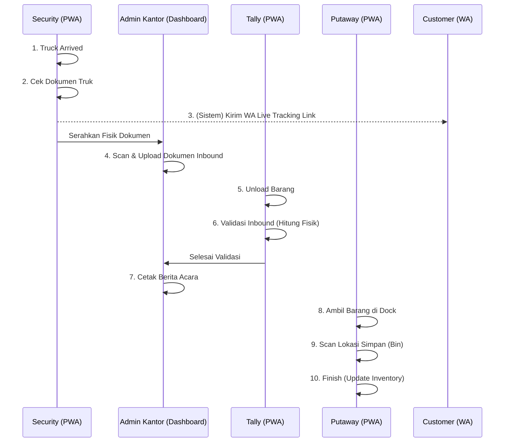

# Rencana Kerja 03 Juni 2026: Warehouse Portal & Alur Inbound

Dokumen ini berisi breakdown rencana pengembangan fitur **Warehouse Portal** dan workflow **Inbound (Barang Masuk)** yang akan kita eksekusi pada tanggal 03 Juni 2026.

> [!IMPORTANT]
> Sistem Inbound ini menggabungkan pekerjaan antara staf kantor (Admin) di dashboard utama, dan operator lapangan (Security, Tally, Putaway) melalui PWA Portal (WhatsApp + PIN login).

---

## 1. Flowchart Alur Inbound

---

## 2. Detail Tugas per Role

### Step 1: Security (Akses via PWA Portal)
- **Tugas**: Mencatat kedatangan truk (*Truck Arrived*).
- **Aksi**: 
  - Mencocokkan nomor polisi truk dan Surat Jalan.
  - Menekan tombol `Arrived` di aplikasi PWA.
- **Fitur Tambahan (Trigger)**: Saat status menjadi `Arrived`, sistem otomatis menembak API WhatsApp untuk mengirimkan **Link Live Update** ke nomor HP Customer agar mereka bisa memantau proses bongkar muat secara real-time.

### Step 2: Admin Kantor (Akses via Dashboard HQ/SBU)
- **Tugas**: Digitalisasi Dokumen.
- **Aksi**: Menerima surat jalan dari Security/Supir, melakukan *scan*, lalu meng-upload file dokumen tersebut ke sistem Inbound pada Job Order terkait.

### Step 3: Tally Checker (Akses via PWA Portal)
- **Tugas**: *Unloading* dan Validasi.
- **Aksi**:
  - Tally membuka Job Order di PWA.
  - Mencatat jumlah aktual barang yang diturunkan dari truk (*Good*, *Damage*).
  - Mengunci (*Submit*) hasil validasi.

### Step 4: Admin Kantor (Akses via Dashboard HQ/SBU)
- **Tugas**: Finalisasi Administrasi.
- **Aksi**: 
  - Mengecek hasil inputan Tally.
  - Mem-*generate* dan mencetak Berita Acara (BAST / Inbound Report) untuk ditandatangani supir.

### Step 5: Putaway Operator (Akses via PWA Portal)
- **Tugas**: Penyimpanan Fisik.
- **Aksi**: 
  - Menerima tugas memindahkan barang dari *Loading Dock* ke dalam Rak.
  - Melakukan *Scan* lokasi penyimpanan akhir (Rak/Bin).
  - Menyelesaikan tugas (*Finish*).

### Step 6: Sistem (Background Job / Edge Function)
- **Tugas**: Inventory Update.
- **Aksi**: Setelah Putaway menyelesaikan tugasnya, sistem otomatis mengkalkulasi dan menambahkan stok pada tabel Inventory gudang.

---

## 3. Persiapan Teknis (Technical Checklist)
- [ ] Menyiapkan struktur tabel database untuk `wh_inbound_tasks` dengan pembagian state (Security -> Admin -> Tally -> Admin -> Putaway).
- [ ] Menyiapkan UI/UX di `/app/warehouse/portal/task` yang menyesuaikan tampilan berdasarkan ROLE login (Tampilan Security beda dengan Tally).
- [ ] Integrasi dengan WhatsApp API untuk fitur "Live Tracking Inbound" ke Customer.
