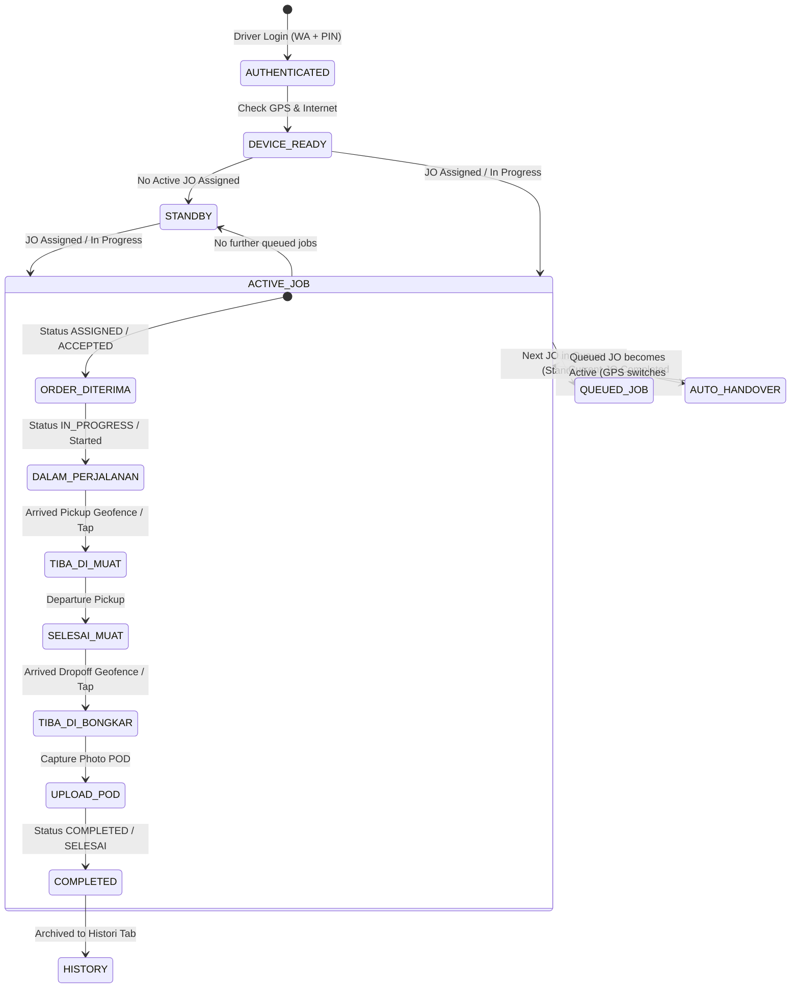
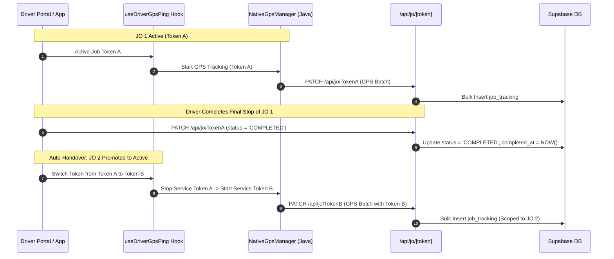

# P0.5 DRIVER PORTAL FORENSIC ARCHITECTURE AUDIT
**Unified Driver Portal & Smart Authentication Architecture**
*Generated: 2026-08-21 | SentraLogis Platform Architecture*

---

## 1. Executive Summary

A comprehensive architectural and forensic audit of the SentraLogis Driver subsystem was conducted across frontend components (`app/driver/**`, `app/jo/**`, `lib/hooks/**`, `lib/services/**`), backend routes (`app/api/driver/**`, `app/api/jo/**`), and database schemas (`md_drivers`, `driver_profiles`, `driver_tenant_links`, `job_orders`, `md_fleets`, `md_entities`).

### Key Forensic Findings:
1. **Severe Frontend Fragmentation**: Three separate pages (`app/driver/portal/page.tsx`, `app/driver/execution/[token]/page.tsx`, `app/driver/order/[token]/page.tsx`) independently duplicate job execution, Google Maps rendering, POD photo upload, stop progression, and GPS ping engines.
2. **State Thrashing in `portal/page.tsx`**: A monolithic 4,671-line file holding 60+ uncoordinated `useState` variables, circular `useEffect` triggers, and overlapping UI modals (Setup Wizard, Absen, Inspeksi, Finansial, SOS, Ganti Supir) creates UI instability and screen flickering.
3. **Internal vs Vendor Driver Identity & Financial Bleed**:
   - Internal drivers have fleet assignments, operational metrics, and revenue share percentages (`driver_revenue_share` / `driver_share_percentage`).
   - Vendor drivers are third-party transporter resources linked to `md_entities` (`is_vendor: true`); their assigned jobs contain vendor purchase prices (`vendor_price`), which the current portal incorrectly surfaces as "Pendapatan Driver" / "Hak Supir".
4. **Authority & Token Ambiguity**: Past implementations mixed client-supplied `driver_id` headers with session JWT tokens and legacy token parameters, causing occasional identity resolution failures.
5. **GPS Token Lifecycle Fragility**: When transitioning between chained jobs (JO 1 -> JO 2), GPS engines must cleanly decouple from component unmount cycles and follow a strict state-driven token handover.

---

## 2. Current Architecture & Component Inventory

```
                    ┌──────────────────────────────────────────────────┐
                    │               CLIENT APPLICATIONS                │
                    ├─────────────────────────┬────────────────────────┤
                    │   PWA Browser / WebView │ Native Android (APK)   │
                    └────────────┬────────────┴────────────┬───────────┘
                                 │                         │
                                 ▼                         ▼
┌─────────────────────────────────────────────────────────────────────────────────────────────────┐
│                                CURRENT FRONTEND ROUTING & PAGES                                 │
├───────────────────────────────┬─────────────────────────────────┬───────────────────────────────┤
│ app/driver/portal/page.tsx    │ app/driver/execution/[token]    │ app/driver/order/[token]      │
│ (4,671 lines, 60+ states,     │ (1,224 lines, duplicates        │ (478 lines, duplicates order  │
│ 6 embedded sub-steps)         │ map, stops, timeline, GPS)      │ acceptance & details)         │
├───────────────────────────────┼─────────────────────────────────┼───────────────────────────────┤
│ app/jo/[token]/page.tsx       │ app/driver/login/page.tsx       │ app/driver/install-apk/page   │
│ (Gateway / Install Gate)      │ (WA + 4-digit PIN form)         │ (APK Distribution download)   │
└───────────────────────────────┴─────────────────────────────────┴───────────────────────────────┘
                                 │
                                 ▼
┌─────────────────────────────────────────────────────────────────────────────────────────────────┐
│                                  BACKEND API GATEWAYS & ROUTES                                  │
├───────────────────────────────┬─────────────────────────────────┬───────────────────────────────┤
│ /api/driver/login             │ /api/driver/feed                │ /api/jo/[token]               │
│ (Signed JWT Token, PIN auth)  │ (Multi-tenant unified feed)     │ (Stops, GPS pings, complete)  │
├───────────────────────────────┼─────────────────────────────────┼───────────────────────────────┤
│ /api/driver/health            │ /api/driver/link-profile        │ /api/jo/[token]/gps-session   │
│ (Server ping latency)         │ (Cross-tenant canonical link)   │ (Native 24h JWT TTL)          │
└───────────────────────────────┴─────────────────────────────────┴───────────────────────────────┘
                                 │
                                 ▼
┌─────────────────────────────────────────────────────────────────────────────────────────────────┐
│                                      DATABASE LAYER (SQL)                                       │
├───────────────────────────────┬─────────────────────────────────┬───────────────────────────────┤
│ driver_profiles (Canonical)   │ driver_tenant_links (Relation)  │ md_drivers (Tenant Master)    │
│ (id, phone, pin_hash, name)   │ (profile_id, tenant_id, driver) │ (id, tenant_id, entity_id)   │
├───────────────────────────────┼─────────────────────────────────┼───────────────────────────────┤
│ job_orders (Dispatched Jobs)  │ job_routes (Pickup/Dropoff)     │ job_tracking (Telemetry logs) │
│ (id, status, driver_id, fleet)│ (seq, stop_type, geofence, pod) │ (lat, lng, speed, recorded_at)│
└───────────────────────────────┴─────────────────────────────────┴───────────────────────────────┘
```

---

## 3. Current Routing Fragmentation

The codebase currently maintains 4 competing entry points for driver workflows:

| Route Path | File Path | Lines | Intended Purpose | Forensic Issues |
| :--- | :--- | :--- | :--- | :--- |
| `/driver/portal` | `app/driver/portal/page.tsx` | 4,671 | Primary multi-tab driver dashboard. | Contains 6 embedded screens (`dashboard`, `profile`, `inspection`, `jobDetail`, `performance`, `history`), leading to state collisions and re-render thrashing. |
| `/jo/[token]` | `app/jo/[token]/page.tsx` | 133 | Deep link gateway from WhatsApp order notifications. | Detects PWA/Native app installation, sets `pending_jo_token` in `localStorage`, then redirects to `/driver/portal` or `/driver/order/[token]`. |
| `/driver/order/[token]` | `app/driver/order/[token]/page.tsx` | 478 | Standalone job order preview & acceptance. | Bypasses driver portal context; re-queries database directly via client-side Supabase SDK. |
| `/driver/execution/[token]`| `app/driver/execution/[token]/page.tsx` | 1,224 | Standalone active job execution interface. | Duplicates 90% of the UI in `portal/page.tsx` (Map, Stop list, Camera POD, SOS, Notes), creating synchronization divergence. |

---

## 4. Current Authentication & Identity Resolution Flow

### Current Step-by-Step Flow:
```text
1. Driver inputs Phone ('08882255627') + PIN ('1234') at /driver/login
   ↓
2. POST /api/driver/login normalizes phone to canonical '628882255627'
   ↓
3. Resolves profile in driver_profiles:
   - Found profile_id: 'f474cb1a-dd17-46dc-a3d0-bfeba7e0d085'
   - Discovers driver_tenant_links across all tenants
   - Resolves all linked md_drivers records (e.g. Tenant A driver_id + Tenant B driver_id)
   ↓
4. Validates PIN against md_drivers.pin or driver_profiles.pin_hash
   ↓
5. Generates Deterministic Signed JWT (HS256) containing:
   { sub: driver.id, driver_id, tenant_id, profile_id, linked_tenant_ids, exp: 30d }
   ↓
6. Stores session in localStorage ('sentralogis_driver_session' & 'sentralogis_driver_id')
   ↓
7. /api/driver/feed uses Bearer JWT to retrieve unified active, queued, and completed jobs.
```

### Security & Authority Finding:
* **Current State**: Server APIs (`/api/driver/feed`, `/api/jo/[token]`) now prioritize the cryptographic Bearer token and decode `driver_id`/`profile_id` server-side.
* **Remaining Vulnerability**: Legacy client components still pass `x-driver-id` headers manually; the backend must strictly enforce token signature verification before permitting any driver mutations.

---

## 5. Internal Driver vs Vendor Driver Flow

| Dimension | Internal Driver | Vendor Driver (Transporter Partner) |
| :--- | :--- | :--- |
| **Origin & Table** | `md_drivers` (`entity_id: NULL`) | `md_drivers` (`entity_id: UUID` -> `md_entities.id`) |
| **Company Affiliation** | Owned by the Tenant directly | Employed by Vendor Entity (e.g., PT Sumber Logistik) |
| **Fleet Assignment** | Internal fleet (`md_fleets.is_vendor = false`) | Vendor fleet (`md_fleets.is_vendor = true`, `vendor_entity_id`) |
| **Financial Structure** | Personal revenue share / Uang Jalan (`driver_revenue_share`, `advance_amount`) | **Vendor Contract Purchase Value (`vendor_price`)**. This is payable to the Vendor Company, **NOT** driver personal income. |
| **Required Portal UX** | Show operational tasks, route stops, driver coins reward. | Show operational tasks, route stops, driver coins reward. **HIDE company contract financials**. |

---

## 6. Driver Identity Resolution: Canonical Context Helper

To prevent UUID fallbacks and ensure the driver's real human name is always rendered, the canonical driver context helper contract is defined as follows:

```typescript
export interface CanonicalDriverContext {
  driverId: string;           // Canonical md_drivers.id for the active tenant
  driverName: string;         // Human name (e.g. "ANTONIO", "Budi Santoso")
  driverType: "INTERNAL" | "VENDOR"; // Resolved from entity_id presence
  tenantId: string;           // Active tenant UUID
  tenantName: string;         // Active tenant brand name
  profileId: string | null;   // Canonical cross-tenant driver_profiles.id
  phone: string;              // Normalized WhatsApp number (628xxx)
  photoUrl: string | null;    // Photo URL from master driver record
  activeFleet: {
    id: string;
    plateNumber: string;      // e.g. "B 9123 XYZ"
    vehicleType: string;      // e.g. "CDD BOX"
    isVendor: boolean;
  } | null;
}
```

---

## 7. Device State & Readiness: Real vs Fake Data

The driver portal must never fabricate device health metrics. The boundary between browser-supported and native-supported telemetry is mapped below:

| Telemetry Metric | PWA Browser / iOS Safari | Native Android APK | Fallback when Unavailable |
| :--- | :--- | :--- | :--- |
| **📱 Device Type** | `navigator.userAgent` (PWA) | Detected (`SentraLogis_AndroidApp` / Capacitor) | `"PWA Browser"` |
| **📡 Internet Status** | `navigator.onLine` + Window listeners | Native Network Plugin + `navigator.onLine` | `"Offline"` |
| **📍 GPS State** | `navigator.permissions` / Geolocation API | Android Foreground Service + GPS Provider | `"Standby (Menunggu Penugasan)"` |
| **🎯 GPS Accuracy** | Geolocation `coords.accuracy` (meters) | Android Fused Location Provider (`accuracy`) | `"-"` |
| **🔋 Battery Level** | Battery API (Android Chrome only) | Android BatteryManager API | `"N/A"` |
| **🔌 Charging State** | Battery API (`charging: boolean`) | Android Intent `ACTION_BATTERY_CHANGED` | `"N/A"` |
| **📶 Network Type** | `navigator.connection.effectiveType` (4G/WiFi) | Android NetworkCapabilities (WiFi/Cellular) | `"Unknown"` |
| **🛰 GPS Telemetry** | Active Web Worker (`gps-worker.js`) | Continuous Native Foreground Service | `"Inactive"` |
| **🕐 Last Sync Time** | Local timestamp of last 200 OK batch | SQLite outbox flush timestamp | `"-"` |

---

## 8. State Model: Database -> Domain -> UI



---

## 9. Proposed Unified Information Architecture & Navigation

To eliminate the 4,671-line monolith and avoid sub-route confusion, the unified portal structure is designed with **exactly 3 bottom navigation tabs**:

```
┌─────────────────────────────────────────────────────────────┐
│                    UNIFIED DRIVER PORTAL                    │
├─────────────────────────────────────────────────────────────┤
│ HEADER:                                                     │
│   [Company Logo] [Tenant Name — Driver Portal]              │
│   "Selamat Datang, ANTONIO" · [Vendor Driver / Internal]   │
│   [ 📱 Info Perangkat ] [ ☀️/🌙 Theme ] [ 🚪 Logout ]       │
├─────────────────────────────────────────────────────────────┤
│                                                             │
│  TAB 1: HOME (Dashboard)                                    │
│  ├── 1. Device Quick Status Banner (GPS, Internet, Battery) │
│  ├── 2. Active Job Card (If exists, with "UPDATE PERJALANAN")│
│  ├── 3. Queued Jobs Card (If exists, with "TERIMA ANTREAN") │
│  └── 4. Standby State (When 0 active/queued jobs)           │
│                                                             │
│  TAB 2: HISTORI (Completed Records Only)                    │
│  ├── 1. Monthly Completed Summary Metric Card               │
│  └── 2. Completed Jobs List (Number, Date, Route, Distance) │
│                                                             │
│  TAB 3: PROFILE (Master Driver Data)                        │
│  ├── 1. Driver Photo, Full Name, WhatsApp, Canonical ID    │
│  ├── 2. License Details (SIM Class, Expiry, Status)         │
│  ├── 3. Associated Tenant & Fleet Plates                    │
│  └── 4. App Version & Native GPS Service Diagnostics        │
│                                                             │
├─────────────────────────────────────────────────────────────┤
│ BOTTOM NAVIGATION:                                          │
│         [ 🏠 HOME ]     [ 📋 HISTORI ]     [ 👤 PROFILE ]   │
└─────────────────────────────────────────────────────────────┘
```

---

## 10. Audit of Hidden / Deferred Workflows

1. **Finance / Keuangan (`HIDDEN / DISABLED`)**:
   - **Reason**: Internal drivers receive revenue share (`driver_revenue_share`), while vendor drivers represent corporate vendor purchase orders (`vendor_price`). Displaying vendor contract totals as driver earnings misleads drivers.
   - **Action**: Finance cards and wallet tabs are removed from primary navigation until specific role-based policies are finalized.
2. **Absen & Shift Check-In (`HIDDEN / OPTIONAL`)**:
   - **Reason**: Shifts are not mandatory for vendor drivers and should not block active job execution.
   - **Action**: Removed from mandatory gating; retained in backend without blocking JO assignment.
3. **Vehicle Inspection (`HIDDEN / OPTIONAL`)**:
   - **Reason**: Pre-trip inspection check-sheets were causing validation failures for drivers with urgent assignments.
   - **Action**: Removed from mandatory gating; accessible only as an optional diagnostic tool.

---

## 11. GPS Token Handover & Lifecycle Architecture



---

## 12. Legacy, Duplicate, and Conflicting Codebase Catalog

| File / Component | Type | Current Status | Issues & Conflicts | Recommendation |
| :--- | :--- | :--- | :--- | :--- |
| `app/driver/portal/page.tsx` | Page Component | **ACTIVE (Bloated)** | 4,671 lines; handles 6 distinct sub-screens via state switching; causes memory leaks and re-render thrashing. | **Refactor**: Split into modular components (`DriverDashboard`, `ActiveJobCard`, `QueuedJobsCard`, `HistoryTab`, `ProfileTab`). |
| `app/driver/execution/[token]/page.tsx` | Page Route | **DUPLICATE** | Duplicates Job Execution UI from `portal/page.tsx`. | **Deprecate**: Direct all job execution into the Unified Driver Portal Job Sheet. |
| `app/driver/order/[token]/page.tsx` | Page Route | **DUPLICATE** | Duplicates job order preview & acceptance logic. | **Deprecate**: Route deep links directly into `/driver/portal?jo=[token]`. |
| `app/jo/[token]/page.tsx` | Page Route | **ACTIVE** | Install gateway for WhatsApp links. | **Retain**: Keep as lightweight install gateway that forwards to `/driver/portal`. |
| `app/driver/components/InfoPerangkat.tsx` | Modal Component | **ACTIVE (Hardened)** | Diagnostic modal for GPS, Network, Sync, and Session. | **Retain**: High-value diagnostic tool for drivers and field operations. |
| `lib/hooks/useDriverGpsPing.ts` | Custom Hook | **ACTIVE (Audited)** | Manages PWA worker, Capacitor bridge, and batch sync. | **Retain**: Core telemetry engine verified in Phase P0.3.2. |
| `lib/services/NativeGpsManager.ts` | Service | **ACTIVE (Audited)** | Coordinates Java Android Foreground Service. | **Retain**: Core native tracking bridge. |
| `lib/offline/offlineSyncEngine.ts` | Offline Engine | **ACTIVE (Audited)** | Offline SQLite and IndexedDB queue sync engine. | **Retain**: Verified with 0 data loss. |

---

## 13. Phased Implementation Roadmap

* **Phase 1: Architecture Audit & Design Review (Current Step)**
  - Deliver forensic report and obtain user sign-off.
* **Phase 2: Information Architecture & UX Simplification**
  - Implement 3-tab layout (`Home`, `Histori`, `Profile`).
  - Isolate Active Job execution into clean modular sheets.
* **Phase 3: State & Data Source Consolidation**
  - Extract monolithic state from `portal/page.tsx` into decoupled sub-components.
  - Implement `CanonicalDriverContext` provider.
* **Phase 4: Smart Auth & Ownership Hardening**
  - Enforce server-side Bearer token validation across all mutations.
  - Formalize internal driver vs vendor driver presentation rules.
* **Phase 5: Regression & Verification Testing**
  - Verify GPS token handover, offline queue, and device telemetry on Samsung Galaxy A32 (`RR8T101AKHX`).

---

## 14. Open Business Decisions Requiring User Confirmation

1. **Vendor Driver Financials**:
   - Confirm that Vendor Drivers should **never** see corporate purchase order values (`vendor_price`) in their personal portal view.
2. **Mandatory vs Optional Daily Facilities**:
   - Confirm that Absen Masuk and Pre-Trip Vehicle Inspection remain optional quick-action buttons on the Profile tab and do not block Job Order execution.
3. **Deep Link Strategy**:
   - Confirm that all WhatsApp job order notifications (`/jo/[token]`) should open directly into `/driver/portal` with the assigned job focused, retiring standalone `/driver/execution/[token]` pages.

---
*End of Forensic Architecture Audit Report.*
